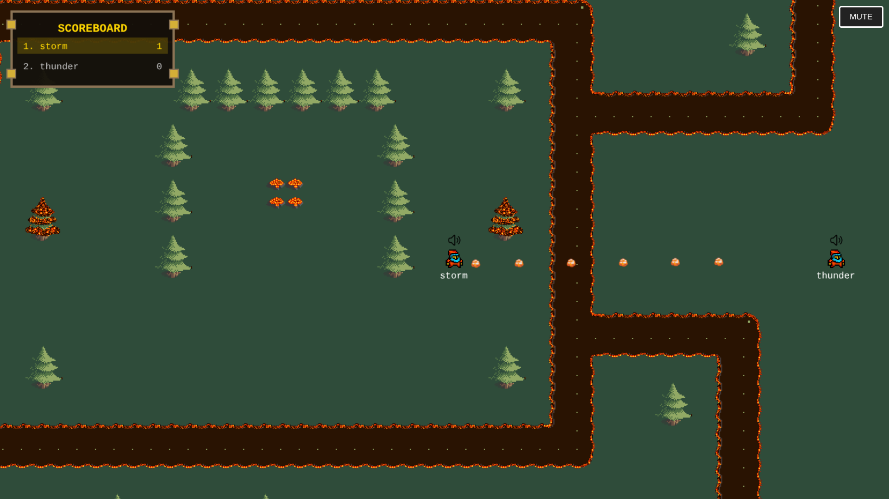
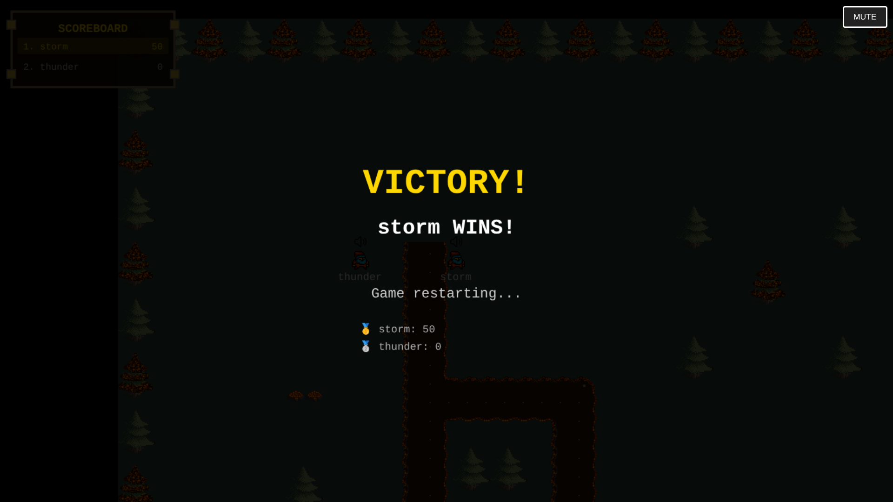

# FlareFight

[Check it out!!!](https://flarefight.onrender.com)
A real-time multiplayer 2D battle arena game with proximity-based voice chat. Fight other players, score points, and become the champion!

**Play Now:**  
👉 [Launch FlareFight](https://flarefight.onrender.com)

## Features

### Core Gameplay
- **Real-time Multiplayer** - Battle against other players in a shared arena
- **Proximity Voice Chat** - Powered by Agora RTC, hear players based on distance
- **Physics-based Combat** - Shoot projectiles at precise angles to hit opponents
- **Tile-based Map** - Navigate through a custom-designed arena with obstacles

### Scoring System
- First to **50 points** wins the match
- Earn points by hitting opponents with projectiles
- Live scoreboard with retro design
- Automatic game reset after victory



### Visual Features
- **Retro-styled UI** - Classic game aesthetics with pixel-perfect graphics
- **Player Names** - Display above each player's character
- **Voice Indicators** - Speaker icons show who's unmuted



## Quick Start

### Prerequisites
- Node.js (v14 or higher)
- npm or yarn

### Installation

1. Clone the repository:
```bash
git clone https://github.com/pavank-v/flarefight.git
```

2. Install dependencies:
```bash
npm install
```

3. Start the server:
```bash
npm run dev
```

4. Open your browser and navigate to:
```
http://localhost:3000
```

## How to Play

### Controls
- **W / ↑** - Move Up
- **A / ←** - Move Left  
- **S / ↓** - Move Down
- **D / →** - Move Right
- **Mouse Click** - Shoot projectile in cursor direction
- **Mute Button** - Toggle microphone on/off

### Gameplay
1. Enter your player name when joining
2. Navigate the map avoiding obstacles
3. Click to shoot projectiles at other players
4. Each successful hit earns you 1 point
5. First player to reach 50 points wins!
6. Game automatically resets after victory

## Technology Stack

### Backend
- **Node.js** - Server runtime
- **Express** - Web framework
- **Socket.IO** - Real-time bidirectional communication
- **Tiled Map Loader** - Custom map loading system

### Frontend
- **HTML5 Canvas** - Game rendering
- **Agora RTC SDK** - Proximity-based voice chat
- **Socket.IO Client** - Real-time updates
- **Vanilla JavaScript** - Game logic

### Game Architecture
- Server-authoritative physics
- Client-side rendering with camera follow
- Collision detection with tile-based obstacles
- Real-time state synchronization

## Configuration

Edit `src/index.js` to customize game settings:

```javascript
const TICK_RATE = 30;           // Server update rate (Hz)
const PLAYER_SPEED = 11;        // Movement speed
const PROJECTILE_SPEED = 15;    // Projectile velocity
const WIN_SCORE = 50;           // Points to win
const RESET_DELAY = 5000;       // Reset delay after win (ms)
```

## Voice Chat Setup

FlareFight uses Agora RTC for proximity-based voice chat:

1. Get your Agora App ID
2. Replace the App ID in `public/index.js`:
```javascript
const options = {
  appid: "YOUR_AGORA_APP_ID",
  channel: "game",
  // ...
};
```

3. Voice volume automatically adjusts based on player distance (max range: 700 pixels)

## Creating Custom Maps

1. Open `src/map.tmx` in Tiled
2. Edit the `ground` layer for floor tiles
3. Edit the `decal` layer for obstacles (with collision)
4. Export and reload the server

## Known Issues & Limitations

- Players must have microphone permissions for voice chat
- Voice chat requires HTTPS in production (use localhost for development)
- Maximum recommended players: 20 (for optimal performance)
- Map size affects collision detection performance

## Contributing

Contributions are welcome! Here are some ideas:

- [ ] Add different weapon types
- [ ] Implement power-ups
- [ ] Add team-based game modes
- [ ] Create more maps
- [ ] Add player customization (skins/colors)
- [ ] Implement matchmaking
- [ ] Add mobile touch controls
- [ ] Create spectator mode

## License

This project is licensed under the MIT License - see the [LICENSE](LICENSE) file for details.

## Acknowledgments

- Built with [Socket.IO](https://socket.io/) for real-time communication
- Voice chat powered by [Agora RTC](https://www.agora.io/)
- Maps created with [Tiled Map Editor](https://www.mapeditor.org/)
- Inspired by classic top-down arena games

## Contact

For questions or feedback, please open an issue or reach out to [pavankumarv.dev@gmail.com]

---

**Made with ❤️ and JavaScript**

⭐ Star this repo if you enjoyed playing FlareFight!